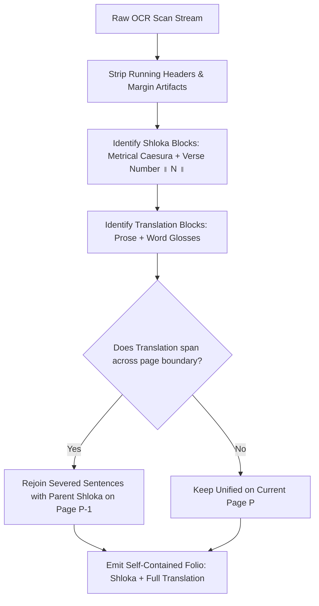

# Universal Bilingual Scripture Folio Alignment & Digitization Standard

This skill codifies the complete liturgical architecture, linguistic safeguards, and automated alignment engine for bilingual sacred scriptures (संस्कृत मूल श्लोक एवं सानुवाद/सार्थ व्याख्या) across all canonical publishers and manuscripts (e.g. Chowkhamba, Motilal Banarsidass, Venkateshwar Press, Ramakrishna Math, Arya Samaj, traditional Pothis, and standard editions).

It guarantees that digitized scriptures maintain pristine 1-to-1 fidelity with physical manuscript page scans while keeping every Shloka and its translation completely self-contained on its respective digital folio.

---

## 1. Anatomy of Physical Print vs Digital Reading Experience

In traditional printed pothi, pocket, and commentary editions of Hindu scriptures:
1. **Running Page Headers (पृष्ठ-शीर्षक):** Every printed page begins with a running header containing the scripture title and physical page number (e.g. `[पृष्ठ] [ग्रन्थ-नाम]`, `[ग्रन्थ-नाम] [पृष्ठ]`, corner abbreviations like `विन... लि`, etc.).
2. **Commentary Overflow (Cross-Page Spillover):** Because printed page dimensions are rigid, the word-by-word gloss (अन्वय/पदार्थ) of the final Shloka on page $N$ often overflows by 1–3 lines onto the top of page $N+1$.
3. **Multi-verse Units (Kulakas / कुलक):** Groups of verses (e.g. Shlokas 10–12) that form a single grammatical syntactic unit and share one combined translation ending with `॥ १०-१२ ॥`.
4. **Standalone Verse Numbers:** Physical typography often places verse markers like `॥ १ ॥`, `॥ २ ॥` either inline or separated by arbitrary linebreaks.

### The Self-Contained Folio Law (स्वायत्त पत्र नियम)
> **Mandatory Law:** Every digital folio must be 100% self-contained:
> - Every Shloka appearing on page $P$ must have its **complete vernacular translation** on page $P$.
> - A page must **never** start with the orphaned tail of a previous page's translation.
> - A page must **never** end with an incomplete translation that cuts off mid-sentence.
> - Running headers from physical scans must **never** be rendered as Shloka cards or section titles.
> - Digital page $P$ must match the physical scan image of page $P$ without 1-page phase shifts or duplicate drift.

---

## 2. Universal Running Header Elimination Engine

Physical book scans contain diverse OCR corruptions of running headers that must be unconditionally filtered out before parsing blocks:

### Canonical Regex Engine
```typescript
/**
 * Detects and suppresses running page headers across all publication styles
 */
export const isRunningScriptureHeader = (line: string, bookTitlePattern?: RegExp): boolean => {
  const trimmed = line.trim();
  if (!trimmed) return true;
  // Margin noise, isolated lines, ornamentation artifacts
  if (/^[।॥\s_—\-~*†‡|]+$/.test(trimmed)) return true;
  if (/^विन[\s.]*लि$/u.test(trimmed)) return true;
  if (/^[०-९\d\s\._—\-~*]*म[ययो०\.\s]+$/u.test(trimmed)) return true;
  if (/^अध्याय\s*[०-९\d]+$/u.test(trimmed)) return true;

  // Running Header matching: [PageNum] [Title] or [Title] [PageNum]
  const defaultTitleRegex = /(?:श्रीमद्भगवद्गीता|(?:श्री|भ्री)?\s*विष्णु.*नाम|सह[स्श].*नाम|स्तोत्रम|स्तोतरम्|स्तोत्राणि)/u;
  const targetRegex = bookTitlePattern || defaultTitleRegex;

  if (
    targetRegex.test(trimmed) &&
    trimmed.length < 65 &&
    !/^[॥\s]*(?:अथ\s+|इति\s+|ॐ\s*तत्सदिति)/u.test(trimmed)
  ) {
    return true; // Strictly a running header, NEVER a shloka or heading card
  }

  return false;
};
```

---

## 3. Sanskrit Visarga Sandhi vs Vernacular Misclassification

In Devanagari OCR, Sanskrit interrogative and relative pronouns are frequently misclassified as vernacular postpositions if strict grammatical boundaries are not respected:

### The Critical Case of 'को' (Sanskrit Pronoun vs Hindi Postposition)
- **In Sanskrit:** The masculine nominative singular pronoun `कः` before voiced consonants undergoes Visarga Sandhi (`अतो रोरप्लुतादप्लुते` / `हशि च`) to become **`को`** (e.g. `को धर्मः सर्वधर्माणां`, `कोऽहम्`, `को न्वयं`, `को वा`).
- **In Hindi:** `को` is an accusative/dative postposition (कर्म/सम्प्रदान कारक), usually attached to nouns in traditional publications (e.g. `मनुष्यको`, `कल्याणको`, `भगवान्को`).
- **Rule:** Standalone `'को'` must **NEVER** be placed in an exclusive vernacular vocabulary list.

### The Visarga Density Law
Vernacular prose translations never contain multiple words ending in Visarga (`ः`).
```typescript
export function isSanskritByMorphology(line: string): boolean {
  const trimmed = line.trim();
  // 1. Multiple visargas in the same line = 100% Sanskrit (e.g. 'धर्मः... भवतः... मतः')
  const visargaMatches = trimmed.match(/[^\s]+ः/gu);
  if (visargaMatches && visargaMatches.length >= 2) {
    return true;
  }
  // 2. Sanskrit genitive plural (-णाम् / -नाम् / -णां / -नां) + Danda caesura
  if (/(?:णां|नां|णाम्|नाम्|ेभ्यः|ेषु|ुषु)\b/u.test(trimmed) && /[।॥]/.test(trimmed)) {
    return true;
  }
  return false;
}
```

---

## 4. Halanta & Virama Boundary Safety

### The Fatal Halanta Bug & Solution
```typescript
// ❌ WRONG: Strips newlines after halanta words and fuses lines!
// 'अथ श्रीविष्णुसहस्रनामस्तोत्रम्\n\nयस्य' -> 'अथ श्रीविष्णुसहस्रनामस्तोत्रम्यस्य'
s = s.replace(/\u094D\s+/gu, '\u094D'); 

// ✅ CORRECT: Only heal spaces BEFORE virama within a broken conjunct, never after:
s = s.replace(/\s+\u094D/gu, '\u094D');
```
Never strip whitespace or line breaks after a virama `\u094D`. Sanskrit words and section titles routinely end in halanta consonants (`स्तोत्रम्`, `भगवान्`, `विष्णुम्`, `शान्तनवं`).

---

## 5. Automated Cross-Page Shloka-Anuvad Stitching Algorithm

When ingesting or healing a multi-page scripture where physical print caused translation overflow:



### Protocol for Spillover Reintegration:
1. Identify the last verse number $N$ on page $P - 1$.
2. On page $P$, if the initial lines consist of translation glosses ending with `॥ N ॥`, match that specific verse number.
3. Append the overflow text to the translation of Shloka $N$ on page $P - 1$.
4. Page $P$ then starts cleanly with its own first Shloka ($N + 1$).

---

## 6. Zero-Label Inline Typography Standard

In reading mode, avoid cluttering administrative badges:
- ❌ Do NOT display: `📿 मूल संस्कृत श्लोक / नाम`
- ❌ Do NOT display: `हिन्दी अनुवाद एवं व्याख्या :`
- ✅ **Display:**
  - Sacred Shloka in Deep Maroon (`#7A1505`), bold, centered, `leading-[2.1]`.
  - Subtle ornamental divider (`❖`).
  - Word-by-word translation in Rich Charcoal (`#1C120C`), natural paragraph leading (`leading-[1.85]`).
  - If Kulaka (multi-verse), group all consecutive Shlokas first, followed by single shared divider and single unified translation.

---

## 7. Universal Publication Agnostic Checklist

- [ ] Zero mention of any modern commercial publisher in book titles, UI headers, descriptions, or code logic.
- [ ] Traditional author attributions preserved (e.g. महर्षि वेदव्यास, आदि शङ्कराचार्य, जयदेव).
- [ ] Every page begins with a clean Section Heading, Speaker Tag, or Shloka Card.
- [ ] Every page ends on a clean verse boundary `॥ N ॥`.
- [ ] No running headers appear in the text.
- [ ] Page numbers in the bottom bar correspond 1-to-1 with original manuscript scan images.
