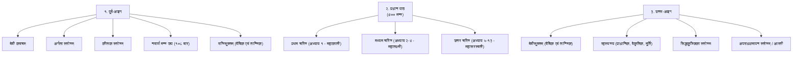

# Scripture Parayana, Samputa & Daily Svadhyaya Standard (पारायण-विधि-सम्पुट-स्वाध्याय-तन्त्रम्)

## 1. Foundational Authority & Theoretical Scope (सैद्धान्तिक भूमिका)

This skill governs the liturgical lifecycle of **Parayana (पारायण - Systematic Scripture Recitation)** and **Samputa (सम्पुट - Enclosed Tantrik/Vedic Chanting)** in Granthalay.

In traditional Hindu sadhana, reading a sacred text is not passive browsing; it is an active spiritual rite (यज्ञ / अनुष्ठान) governed by:
- **सङ्कल्प (Sankalpa)**: काल, देश, गोत्र, कामना एवं देवता का शास्त्रीय उच्चारण।
- **अङ्गाङ्गि-भाव (Liturgical Anatomy)**: पूर्व-अङ्ग (कवच, न्यास, मन्त्र), प्रधान पाठ, तथा उत्तर-अङ्ग (रहस्य, आरती, समर्पण)।
- **विश्राम-नियम (Resting Stops)**: नवाह्न (९ दिन), सप्ताहान (७ दिन), अथवा मास-पारायण के निश्चित विराम-स्थल।
- **सम्पुट-विधान (Samputa)**: मूल श्लोक को अभीष्ट मन्त्र से आवेष्टित (Encapsulate) करना।

---

## 2. Canonical Parayana Schedules (पारायण अनुक्रम)

### २.१ सप्ताहान पारायण (7-Day Recitation — श्रीमद्भागवत महापुराण)
श्रीमद्भागवत के १२ स्कन्धों, ३३५ अध्यायों और १८,००० श्लोकों का सप्ताह पारायण श्रीमद्गोकर्ण एवं सनकादि ऋषियों द्वारा उपदिष्ट पारम्परिक क्रम है:

```
┌──────┬────────────────────────────────────────────┬────────────────────────┐
│ दिवस │ पाठ-विस्तार (Skandhas & Chapters)          │ प्रमुख कथा-प्रसङ्ग    │
├──────┼────────────────────────────────────────────┼────────────────────────┤
│ १    │ स्कन्ध १, स्कन्ध २, स्कन्ध ३ (अध्याय १-१९) │ परीक्षित् जन्म, वराह अवतार│
│ २    │ स्कन्ध ३ (अध्याय २०-३३) एवं स्कन्ध ४ पूर्ण │ कपिल गीता, ध्रुव-पृथु चरित्र│
│ ३    │ स्कन्ध ५, स्कन्ध ६, स्कन्ध ७ पूर्ण         │ भरत चरित्र, प्रह्लाद-नृसिंह│
│ ४    │ स्कन्ध ८, स्कन्ध ९, स्कन्ध १० (पूर्वार्ध १-४०)│ गजेन्द्रमोक्ष, वामन, कृष्ण जन्म│
│ ५    │ स्कन्ध १० (पूर्वार्ध ४१ से ८४ अध्याय)      │ महारास, कंस वध, मथुरा लीला│
│ ६    │ स्कन्ध १० (उत्तरार्ध समाप्त) एवं स्कन्ध ११ │ द्वारका लीला, उद्धव गीता │
│ ७    │ स्कन्ध १२ पूर्ण + भागवत माहात्म्य + हवन    │ कलियुग धर्म, शुकदेव विदाई│
└──────┴────────────────────────────────────────────┴────────────────────────┘
```

---

### २.२ नवाह्न पारायण (9-Day Recitation — श्रीरामचरितमानस)
गोस्वामी तुलसीदास कृत श्रीरामचरितमानस के नवाह्न पारायण के ९ विश्राम स्थल (गीता प्रेस मानक):

1. **विश्राम १**: बालकाण्ड (मङ्गलाचरण से शिव-चरित्र, सती-मोह तथा पार्वती-तपस्या तक)।
2. **विश्राम २**: बालकाण्ड (नारद-मोह, श्रीराम-जन्म से सीता-स्वयंवर एवं धनुषभङ्ग तक)।
3. **विश्राम ३**: बालकाण्ड पूर्ण (परशुराम-लक्ष्मण संवाद तथा श्रीराम-सीता विवाह महोत्सव)।
4. **विश्राम ४**: अयोध्याकाण्ड (राम-राज्याभिषेक मन्थरा-कैकेयी संवाद से राजा दशरथ-मरण तक)।
5. **विश्राम ५**: अयोध्याकाण्ड पूर्ण (भरत का चित्रकूट आगमन, पादुका-ग्रहण एवं भरत-विदाई)।
6. **विश्राम ६**: अरण्यकाण्ड एवं किष्किन्धाकाण्ड पूर्ण (शूर्पणखा, सीता-हरण, शबरी, सुग्रीव-मैत्री, बालि-वध)।
7. **विश्राम ७**: सुन्दरकाण्ड पूर्ण (हनुमद्-समुद्रोल्लङ्घन, लङ्का-दहन, विभीषण-शरणागति)।
8. **विश्राम ८**: लङ्काकाण्ड पूर्ण (सेतुबन्ध, लक्ष्मण-शक्ति, कुम्भकर्ण-मेघनाद-रावण वध, विभीषण-अभिषेक)।
9. **विश्राम ९**: उत्तरकाण्ड पूर्ण (श्रीराम-राज्याभिषेक, काकभुशुण्डि-गरुड़ संवाद, आरती एवं फलश्रुति)।

---

## 3. The Liturgical Anatomy of Sri Durga Saptashati (दुर्गासप्तशती पाठ-विधान)

दुर्गासप्तशती (चण्डीपाठ) का पारायण 'त्र्यङ्ग' अथवा 'षडङ्ग' विधि से ही फलदायी होता है:



---

## 4. The Automated Samputa Mantra Engine (सम्पुट-विधान तन्त्र)

### ४.१ सम्पुट की शास्त्रीय परिभाषा
> **द्वयोः पुटयोर्मध्ये यथा वस्तु सुरक्षितं भवति, तथैव मन्त्रद्वयमध्ये श्लोकस्थापनं सम्पुटम् उच्चते।**  
> *(जैसे दो सम्पुटों (कटोरियों) के मध्य वस्तु सुरक्षित रहती है, वैसे ही आदि और अन्त में सम्पुट-मन्त्र लगाकर मूल श्लोक का पाठ करना 'सम्पुट' कहलाता है।)*

### ४.२ सम्पुट के प्रकार (Mechanics)
1. **आदि-अन्त सम्पुट (Universal Samputa)**:
   $$\text{[सम्पुट मन्त्र]} \rightarrow \text{[मूल श्लोक]} \rightarrow \text{[सम्पुट मन्त्र]}$$
2. **प्रति-पाद सम्पुट (Intense Tantrik Samputa)**:
   श्लोक के प्रत्येक चरण (पाद) के बाद सम्पुट मन्त्र का उच्चारण।

### ४.३ प्रसिद्ध सम्पुट मन्त्र संग्रह (Canonical Samputa Catalog)

| अभीष्ट फल | सम्पुट मन्त्र | ग्रन्थ सन्दर्भ |
|---|---|---|
| **सर्वबाधा-मुक्ति** | *सर्वाबाधाप्रशमनं त्रैलोक्यस्याखिलेश्वरि। एवमेव त्वया कार्यमस्मद्वैरिविनाशनम्॥* | दुर्गासप्तशती ११.३९ |
| **आरोग्य एवं सौभाग्य**| *देहि सौभाग्यमारोग्यं देहि मे परमं सुखम्। रूपं देहि जयं देहि यशो देहि द्विषो जहि॥* | अर्गला स्तोत्र २ |
| **विपत्ति-निवारण** | *शरणागतदीनार्तपरित्राणपरायणे। सर्वस्यार्तिहरे देवि नारायणि नमोऽस्तु ते॥* | दुर्गासप्तशती ११.१० |
| **दारिद्र्य-नाश** | *दुर्गे स्मृता हरसि भीतिमशेषजन्तोः स्वस्थैः स्मृता मतिमतीव शुभां ददासि। दारिद्र्यदुःखभयहारिणी का त्वदन्या सर्वोपकारकरणाय सदार्द्रचित्ता॥* | दुर्गासप्तशती ४.१७ |
| **सङ्कट-निवारण** | *दीनदयाल विरदु संभारी। हरहु नाथ मम संकट भारी॥* | श्रीरामचरितमानस |
| **विद्या-प्राप्ति** | *जेहि पर कृपा करहिं जनु जानी। कवि उर अगिनि नचावहिं बानी॥* | श्रीरामचरितमानस |

### ४.४ ग्रन्थालय का डायनामिक सम्पुट रेंडरिंग इंजन (Dynamic Samputa UI)
ग्रन्थालय में मूल डेटाबेस के श्लोकों को कभी भी सम्पुट मन्त्र जोड़कर दूषित (pollute) नहीं किया जाता।
जब पाठक UI में **"सम्पुट पाठ चालू करें" (Toggle Samputa)** का चयन करता है:
1. सिस्टम ड्रॉपडाउन से अभीष्ट सम्पुट मन्त्र चुनवाता है।
2. रेंडरिंग कम्पोनेंट ऑन-द-फ़्लाई प्रत्येक श्लोक के पूर्व और पश्चात् सम्पुट मन्त्र को विशिष्ट वर्ण (`#8C2D19`) और इटैलिक्स में सजाकर प्रस्तुत करता है।
3. ऑडियो/जप मोड में भी यह स्वचालित रूप से इसी अनुक्रम में मन्त्र-पाठ कराता है।

---

## 5. Sankalpa & Samarpanam Architecture (सङ्कल्प एवं समर्पण विधान)

### ५.१ पारम्परिक सङ्कल्प सूत्र (Standard Sankalpa Template)
> **ॐ विष्णुर्विष्णुर्विष्णुः श्रीमद्भगवतो महापुरुषस्य विष्णोराज्ञया प्रवर्तमानस्य अद्य श्रीब्रह्मणो द्वितीये परार्धे श्वेतवाराहकल्पे वैवस्वतमन्वन्तरे अष्टाविंशतितमे कलियुगे कलिप्रथमचरणे भूर्लोके जम्बूद्वीपे भारतवर्षे भरतखण्डे आर्यावर्तैकदेशे... [अमुक]-गोत्रोत्पन्नः... [अमुक]-शर्मा/वर्मा/गुप्तः... मम कायिक-वाचिक-मानसिक-सकल-दुरितोपशमनार्थं... श्री[इष्टदेवता]-प्रीत्यर्थं... [ग्रन्थनाम]-पारायणमहं करिष्ये।**

### ५.२ समर्पण मन्त्र (Final Dedication)
> **गुह्यातिगुह्यगोप्ता त्वं गृहाणास्मत्कृतं जपम्।**  
> **सिद्धिर्भवतु मे देव त्वत्प्रसादात्त्वयि स्थिते॥**  
> **कायेन वाचा मनसेन्द्रियैर्वा बुद्ध्यात्मना वा प्रकृतेः स्वभावात्।**  
> **करोमि यद्यत् सकलं परस्मै नारायणायेति समर्पये तत्॥**
